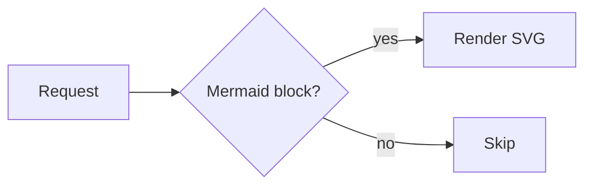
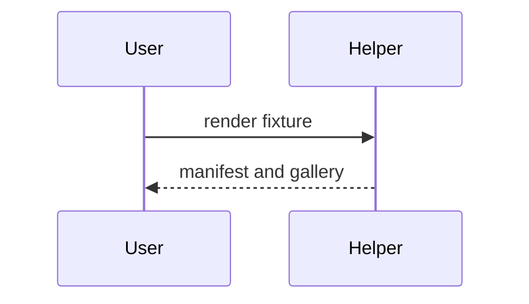

# Render fixture

```mermaid
flowchart LR
    A[Request] --> B{Mermaid block?}
    B -->|yes| C[Render SVG]
    B -->|no| D[Skip]
```

```mermaid
sequenceDiagram
    participant User
    participant Helper
    User->>Helper: render fixture
    Helper-->>User: manifest and gallery
```
